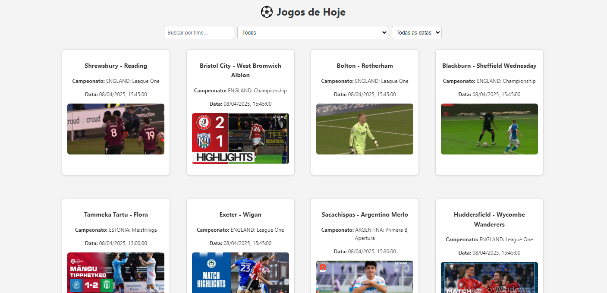

# ⚽ Placar ao Vivo

Aplicação web que consome a API pública da Scorebat para exibir vídeos e informações sobre jogos de futebol recentes. Os usuários podem filtrar por time, campeonato e data, além de carregar mais jogos conforme necessário.

## 📸 Preview


## 🚀 Funcionalidades

- 🔍 Busca de jogos por time
- 🏆 Filtro por campeonato
- 🗓️ Filtro por data (hoje, últimos 3 ou 7 dias)
- ▶️ Exibição de vídeos dos jogos com miniaturas clicáveis
- ➕ Carregamento progressivo dos jogos ("Carregar mais")

## 🧪 Tecnologias utilizadas

- HTML5
- CSS3
- JavaScript (ES6+)
- [Scorebat API](https://www.scorebat.com/video-api/)

## 📦 Como executar o projeto

1. Clone o repositório:
   ```bash
   git clone https://github.com/gabrielfelip/placar-ao-vivo.git

2. Acesse a pasta do projeto:
cd placar-ao-vivo

3. Abra o arquivo index.html no navegador:
Clique duas vezes nele, ou use a extensão Live Server no VSCode.

## 💡 Aprendizados
Durante o desenvolvimento deste projeto, aprendi a:

Consumir e tratar APIs REST com JavaScript puro

Trabalhar com eventos e manipulação de DOM

Implementar filtros dinâmicos com base em dados

Criar uma experiência de carregamento progressiva

Estruturar um projeto simples e funcional do zero

## 📄 Licença
Este projeto está sob a licença MIT.


